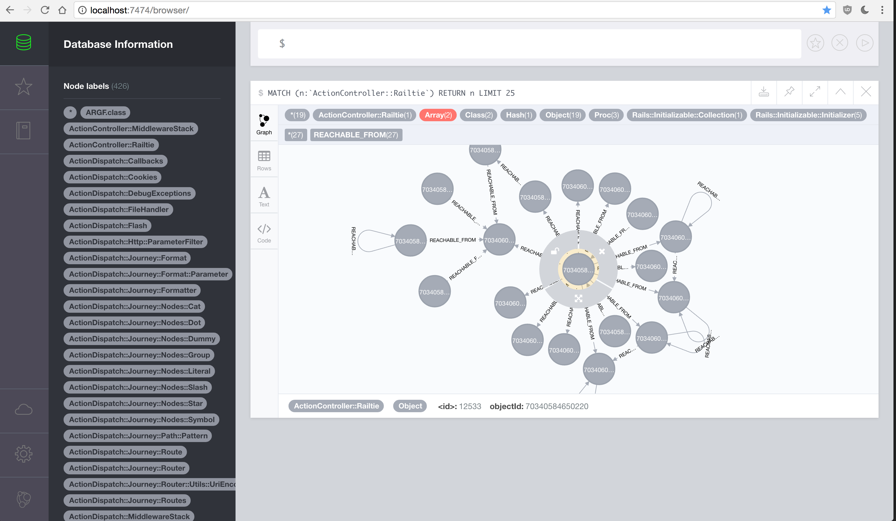

# Ruby Heap Graph

Provides the ability to visualise and query the references between objects in Ruby's heap by exporting the heap into a graph database ([Neo4j](https://neo4j.com/)).

Useful for investigating memory leaks, it allows one to:

- Search by class and analyze the references held in memory by that class
- Search for objects that may be leaking memory by aggregating their references

## Usage

1. Add the Gem to your Gemfile

    ```ruby
    gem 'ruby_heap_graph', git: 'git@github.com:joshuafleck/ruby_heap_graph.git'
    ```

1. Trigger the graph to be built in your application. You will be presented with a prompt you must accept before the export will proceed. *Note: The initial installation of Neo4j may fail the first time with a `Directory not empty` error - re-run the build to get around this.*

    ```ruby
    RubyHeapGraph.build
    ```

1. Open Neo4j in your browser: `http://localhost:7474`. Use [Cypher](https://neo4j.com/developer/cypher-query-language/) (Neo4j's query language) to query the graph.



## How it works

It uses the Ruby [ObjectSpace](http://ruby-doc.org/stdlib-2.1.0/libdoc/objspace/rdoc/ObjectSpace.html) library to find all reachable objects in memory for each object in the Ruby process. It dumps the object ids, class names, and object references for each object to temporary file, then it runs the Neo4j [import tool](http://neo4j.com/docs/operations-manual/current/tutorial/import-tool/) to load this information into a graph database. It also performs the following:

1. Installs Neo4j
1. Stops Neo4j during the import
1. Removes any existing Neo4j database
1. Restarts Neo4j once the import is complete

## Querying the graph

Finding objects of a particular class (`ActionController::Railtie`):

```cypher
MATCH (n:`ActionController::Railtie`) RETURN n LIMIT 25
```

Finding the objects with the most references:

```cypher
MATCH ()-[r:REACHABLE_FROM]->(parent)
RETURN parent, COUNT(r)
ORDER BY COUNT(r) DESC
LIMIT 10
```
